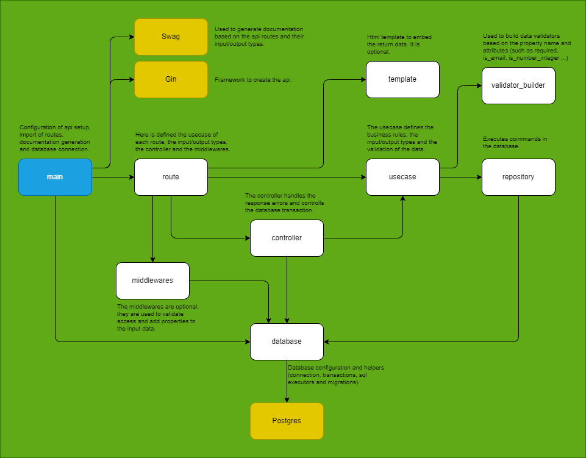

# golang-api-template
A premade template for building rest apis fast and easy using Golang.



## Technologies
- Golang
- Gin
- Swag
- Docker
- Postgres

## Running
Start the api using the following command:
```bash
docker compose up --build
```
Then you can access the api at http://localhost:9090 and the docs at http://localhost:9090/docs

## Usage

### Database
The database configuration can be found at the`src/infra/database` directory. It includes the connection, migrations, transactions and repository.

### Migrations
All migrations can be found in the `db/migrations` directory. They are executed using the `src/infra/database/migrations.go` file when the api is started.

### Repositories
All repositories have the default crud methods implemented. You can find the repositories in the `src/infra/repositories` directory. They extend the `src/infra/database/repository.go` repository and add some configuration to define the table, id field and fields to be used in the repository.

### Entities
All entities can be found in the `src/domain/abstract/entities` directory. They are used to represent the data, generally used to add usecases output types.

### Validator
It is used to build the data validators for the usecases. The default validator builder can be found at `src/domain/utils/validator_builder.go`.

### Usecases (Services)
All usecases have the configuration of validators and the implementation of the execute method. They extend the `src/domain/usecases/usecase.go` usecase file. You can find the usecases in the `src/domain/usecases` directory. They are responsible for validating the data and executing the business logic.

### Controller
Used to controll the database transaction and the response error. The default controller can be found at `src/presentation/controllers/controller.go`

### Middlewares
Used to validate access and add properties to the input data. All midddlewares can be found in the `src/presentation/middlewares` directory and extend the `src/presentation/middlewares/middleware.go` middleware, adding the execute method.

### Routes
All routes are defined in the `src/main/routes` directory. Each route is a struct that contains the name, path, method, controller, middlewares, request type and response type.

### Templates
Every route can be configured to use a HTML template to embed the returned data. All templates can be found in the `src/presentation/templates` directory.

### Main
The `main.go` file is the entry point of the api. It is responsible for starting the api, importing the routes and generating the documentation automatically based on the routes.

## Author
- [Douglas Volcato](https://github.com/douglasvolcato)
